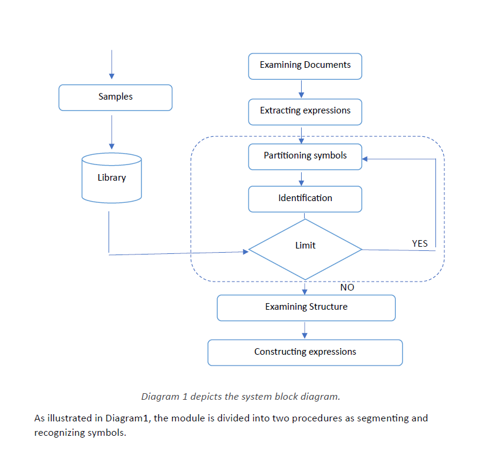

# 🧠 Math Symbol Recognition (Research Project)

This repository documents the design and theoretical background of an image recognition system that detects and classifies **mathematical symbols** in documents, with the goal of converting them to digital formats like LaTeX or MathML.

**"Exploring Image Recognition in Deciphering Mathematical Symbols"**  
By Glawin John Alva.

---

## 📘 Project Overview

OCR systems often fail at recognizing math expressions due to:
- 2D structure of math symbols (fractions, roots)
- Wide range of characters (Greek, Latin, operators, etc.)
- Compound and disjoint symbols

This project presents a research-backed framework for recognizing math expressions using:
- Symbol segmentation techniques
- Feature extraction (aspect ratio, line elements, etc.)
- Classification using distance-based methods

---

## 🔍 Recognition Pipeline

1. **Expression Detection** – Locate math blocks in documents
2. **Symbol Segmentation** – Using projection profile + connected components
3. **Feature Extraction** – Extract edge/peripheral features, line element vectors
4. **Classification** – Using Minimum Distance + Euclidean Deviation (EDD)

---

## 📄 Report

You can find the full technical report in the [`report/`](Main_Report) folder:
- System architecture
- Equations and algorithms
- Examples and experiments

---

## 🚀 Future Work

This repository will be expanded with:
- 🧠 Python implementation of segmentation and recognition
- 🧪 Demo datasets and test cases
- 🔤 LaTeX/MathML output generation
- 🖥️ Web-based UI for real-time input

---

## 🙋 Want to Contribute?

Feel free to fork this repo and help build the actual implementation based on this research!

---

## 📜 License

MIT – free to use, extend, or cite.
